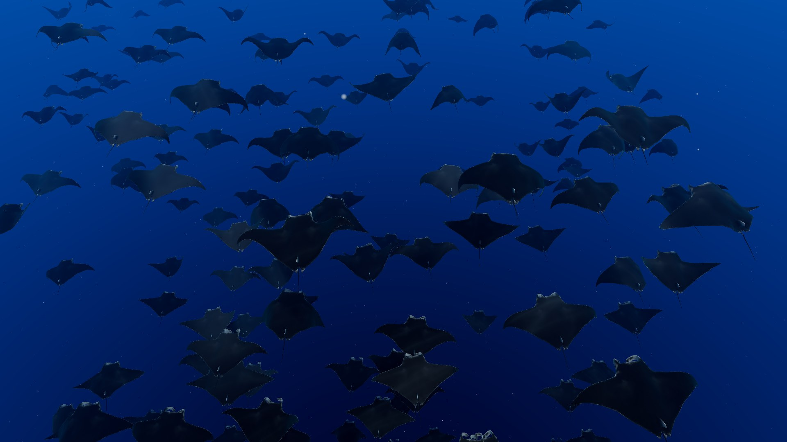
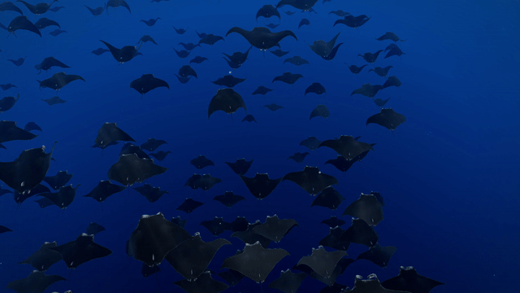
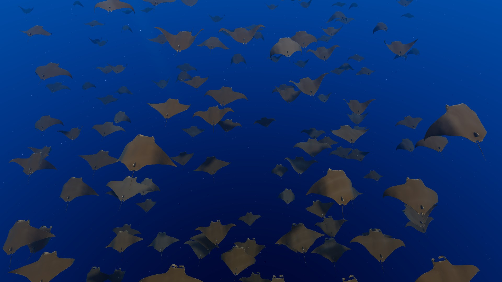
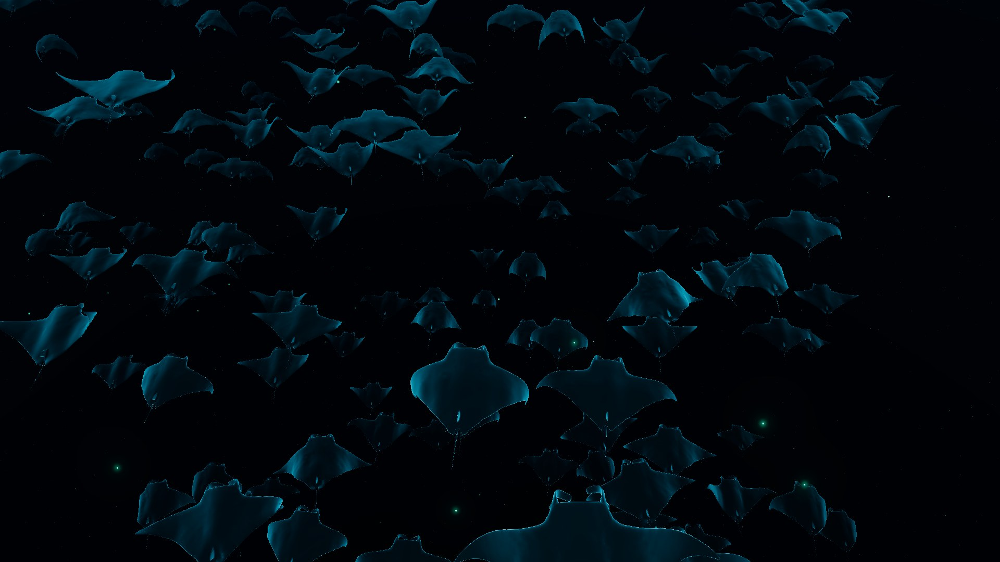
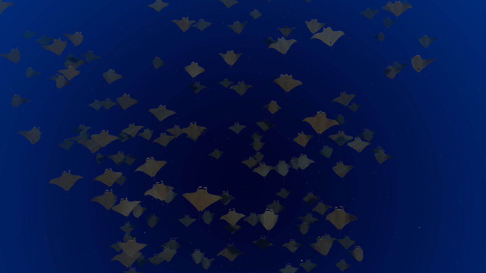
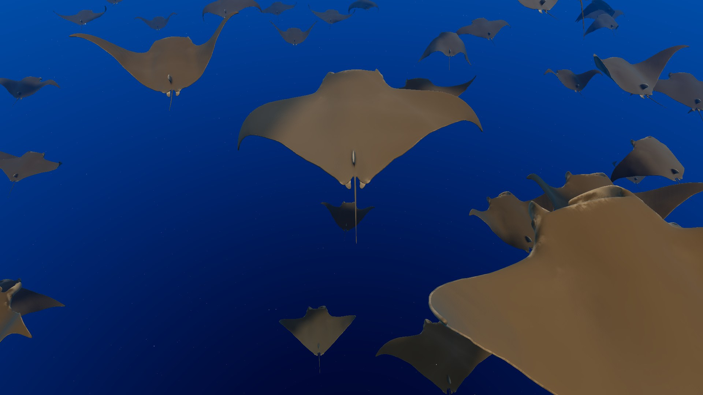
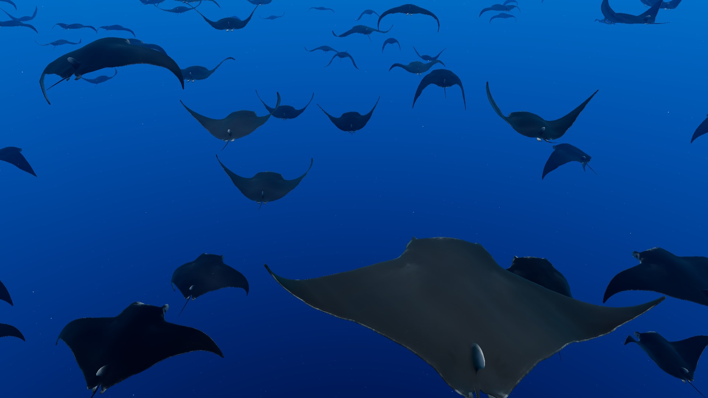

# Manta School

A calm, endless school of manta rays gliding through open blue water. A free live wallpaper for [Lively Wallpaper](https://www.rocksdanister.com/lively/) on Windows.

<!-- VIDEO: on github.com, edit this file and drag demo.mp4 onto this line; GitHub turns it into a video player. Then delete this comment. -->

## Download

**[Download the latest version](https://github.com/Muffism/manta-school-wallpaper/releases/latest)** (file: MantaSchool_v1.6_Lively.zip)

## Install

1. Install [Lively Wallpaper](https://www.rocksdanister.com/lively/) (free, from the Microsoft Store or its website).
2. In Lively, click **Add Wallpaper** and choose the downloaded zip, or drag the zip into Lively.
3. Click the wallpaper to set it, then open **Customise** to change the settings.
4. For the mouse controls, switch on mouse input forwarding in Lively's settings.

## What you get

* Hundreds of mantas swimming together in open ocean, each with a smooth, natural wingbeat
* Sunlight that fades with depth, soft rays from the surface, drifting marine snow
* Natural black mantas, or a golden look inspired by schools of cownose rays
* Daylight, or a dark night glow look with plankton that lights up around the mantas
* A slow drift behind the school, or a big slow 360 degree circle around it
* Top view (looking down onto their backs) and bottom view (looking up into the light)
* Adjustable number of mantas, swim speed, camera speed and wingbeat speed
* Low memory mode for laptops and integrated graphics
* Gentle ambient sound (can be switched off)

## Mouse controls

* **Click and drag:** rotate the view around the school, even underneath to look straight up
* **Double click and hold, then drag up or down:** zoom in or out (there is also a Zoom slider in the settings)
* **Double click:** back to the default view

## Screenshots

## Performance

* Uses about 150 MB of video memory at 1080p with the default 400 mantas
* Runs on dedicated and integrated graphics; on a laptop, Windows may pick the power saving Intel GPU. You can set Lively to use your faster GPU in Windows Settings, System, Display, Graphics
* Low memory mode (in the settings) turns shadows off, runs at 30 fps, renders at 75 percent and caps the school at 250 mantas
* Lively pauses the wallpaper when a full screen app is in front

## Credits

* 3D manta model: ["MANTA"](https://sketchfab.com/3d-models/manta-cdc4752c492c43559caa4cfb528000d8) by [misaooo](https://sketchfab.com/misaooo), licensed [CC BY NC 4.0](https://creativecommons.org/licenses/by-nc/4.0/). Textures resized, animation resampled and smoothed into a seamless loop, recoloured and relit in the wallpaper.
* Rendering: [three.js](https://threejs.org) (MIT licence)
* Wallpaper, code, lighting and ocean: Muffism

Full details in [CREDITS.txt](CREDITS.txt).

## Licence

Free to download and use for personal use, and free to share unchanged with credit. Not for sale. The code may not be modified, reused, or used for AI training or AI assisted editing without permission. See [LICENSE.txt](LICENSE.txt). The manta model stays under its own CC BY NC 4.0 licence, which is why this wallpaper can never be sold.

## Support

If Manta School makes your desktop a little calmer, you can support my work here:

